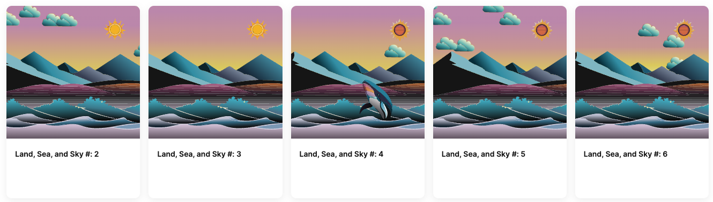

# Land, Sea, and Sky NFT

Land, Sea, and Sky is an NFT project that demonstrates building complex NFTs fully onchain.

To support the frames demo, only the owner of the contract can mint, but can assign the recipient.

The owner also has the power to upgrade an NFT, which will cause the whale to render.

Learn how to make this smart contract! [Tutorial](https://docs.base.org/building-with-base/guides/complex-onchain-nfts)

Ask Brian Doyle for details.
